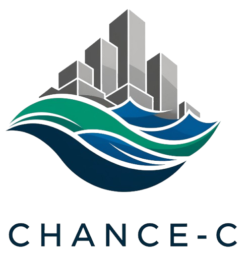

.. CHANCE-C documentation master file

.. raw:: html

   

   <h2>An Agent-Based Modeling Framework for Coastal Urban Development</h2>
   

.. raw:: html

   

|test| |python| |license|

.. raw:: html

   

.. |test| image:: https://github.com/jimyoon/icom_abm/actions/workflows/build.yml/badge.svg
   :target: https://github.com/jimyoon/icom_abm/actions/workflows/build.yml
   :alt: Test Status

.. |python| image:: https://img.shields.io/badge/python-3.11+-blue.svg
   :target: https://www.python.org/downloads/
   :alt: Python Version

.. |license| image:: https://img.shields.io/badge/license-BSD--2--Clause-green.svg
   :target: https://github.com/jimyoon/icom_abm/blob/main/LICENSE
   :alt: License

CHANCE-C is a comprehensive agent-based modeling framework designed to simulate urban development dynamics in flood-prone coastal environments. The framework integrates household decision-making, housing market dynamics, environmental hazards, and policy interventions.

Features
--------

- **Agent-Based Modeling**: Simulates individual household agents with realistic decision-making
- **Housing Market Dynamics**: Models supply, demand, pricing, and development
- **Environmental Hazards**: Integrates flood risk and extreme weather impacts
- **Intervention Analysis**: Supports scenario testing and intervention evaluation
- **Geospatial Integration**: Built on robust geospatial data handling
- **Modular Architecture**: Extensible framework for custom simulations
- **Comprehensive Testing**: Full test suite and CI/CD pipeline

Quick Start
-----------

Install CHANCE-C using pip:

.. code-block:: bash

   pip install chance_c

Create and run your first simulation:

.. code-block:: python

   from chance_c import Model

   # Create a model with default settings
   model = Model()

   # Run simulation
   model.run_simulation()

   # Access results
   print(f"Total population: {model.simulator.network.total_population}")

For detailed installation instructions and setup, see :doc:`getting_started`.

Documentation Structure
-----------------------

.. toctree::
   :maxdepth: 2
   :caption: Getting Started

   getting_started
   installation
   quickstart
   faq

.. toctree::
   :maxdepth: 2
   :caption: User Guide

   user_guide
   configuration
   data_requirements
   field_mapping

.. toctree::
   :maxdepth: 2
   :caption: Tutorials

   tutorials/index
   tutorials/quickstarter.ipynb
   tutorials/configuration.ipynb
   tutorials/custom_simulations.ipynb

.. toctree::
   :maxdepth: 2
   :caption: Examples

   examples/index
   examples/basic_usage
   examples/custom_data
   examples/scenario_analysis

.. toctree::
   :maxdepth: 2
   :caption: API Reference

   api/index
   modules

.. toctree::
   :maxdepth: 2
   :caption: Development

   contributing
   changelog
   license

Support and Community
----------------------

- **Issues**: `GitHub Issues <https://github.com/jimyoon/icom_abm/issues>`_
- **Discussions**: `GitHub Discussions <https://github.com/jimyoon/icom_abm/discussions>`_
- **Source Code**: `GitHub Repository <https://github.com/jimyoon/icom_abm>`_

References
----------

**Fundamental Publication:**

Yoon, Jim, Heng Wan, Brent Daniel, Vivek Srikrishnan, and David Judi. "Structural model choices regularly overshadow parametric uncertainty in agent-based simulations of household flood risk outcomes." *Computers, Environment and Urban Systems* 103 (2023): 101979. `https://doi.org/10.1016/j.compenvurbsys.2023.101979 <https://doi.org/10.1016/j.compenvurbsys.2023.101979>`_

This publication introduces the core methodology and agent-based modeling framework that underpins CHANCE-C, establishing the theoretical foundation for household decision-making in flood-prone environments.

Indices and tables
==================

* :ref:`genindex`
* :ref:`modindex`
* :ref:`search` 